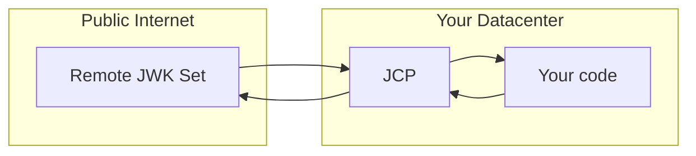

# jcp

This is a [JWK Set](https://www.rfc-editor.org/rfc/rfc7517) client proxy, JCP for short. It is used to validate JWTs
that were signed by a key that lives in a remote JWK Set. JCP caches the JWK Set in memory and automatically refreshes
the JWK Set as configured.

This project serves a few primary use cases:

1. The language or shell a program is written in does not have an adequate JWK Set client. Validate JWTs with `curl`?
   Why not?
2. Restrictive networking policies prevent a program from accessing the remote JWK Set directly.
3. Many co-located services need to validate JWTs that were signed by a key that lives in a remote JWK Set.

It is recommended that JCP is hosted in the same environment (data center) as the program verifying JWTs to reduce
latency.



# API Specifications

This proxy server implements a Swagger 2.0 and OpenAPI 3 specification. Please see `swagger.yml` for the Swagger 2.0
specification and `openapi.yml` for the OpenAPI 3 specification.

These specification files can be used to generate client code for your favorite language. However, there is only one
small endpoint for JWT validation so hand-coding a client is reasonable.

# Installation

This project can be installed via a Docker or using the Go toolchain.

## Docker

Pull the image:

```bash
docker pull micahparks/jcp
```

See `docker-compose.yml` for a working Docker Compose example.

## Go

Confirm you have [Go installed](https://go.dev/). The minimum required version can be found in `go.mod`.

```bash
go install github.com/MicahParks/jcp/cmd/proxy@latest
```

Or you can compile the by downloading this repository, making it your current working directory and running the below
commands:

```bash
cd cmd/proxy/
go build
```

After these commands have been run, the `proxy` executable will be in the `cmd/proxy/` directory.

# Validation features

Below is a table of [JWT registered claims](https://www.rfc-editor.org/rfc/rfc7519#section-4.1) and the validation
behavior of JCP.

| JWT Validation Type     | Behavior    |
|-------------------------|-------------|
| Cryptographic signature | automatic   |
| `alg` header            | automatic   |
| `exp` claim             | automatic   |
| `iat` claim             | automatic   |
| `nbf` claim             | automatic   |
| `aud` claim             | per request |
| `iss` claim             | per request |
| `sub` claim             | per request |

# Configuration

This project is configured via JSON. This program will check three places for this configuration JSON on startup in this
order:

1. The `CONFIG_JSON` environment variable's raw contents.
2. The `CONFIG_PATH` environment variable will be read. If non-empty, it will attempt to parse the file at that path.
3. The `config.json` file in the current working directory.

## Configuration JSON structure

```json
{
  "jwks": {
    "https://example.com/jwks.json": {
      "refreshInterval": "1h",
      "refreshTimeout": "10s"
    }
  },
  "listenAddress": ":8080",
  "logFormat": "json",
  "requestMaxBytes": 1048576
}
```

| JSON Attribute    | Description                                                                                                                                                                  | Example   | Default Value | Required |
|-------------------|------------------------------------------------------------------------------------------------------------------------------------------------------------------------------|-----------|---------------|----------|
| `jwks`            | An object mapping remote JWK Set URLs to their options.                                                                                                                      | see above | none          | required |
| `refreshInterval` | The amount of time to wait before automatically refreshing the remote JWK Set resource. It uses [Go syntax for `time.ParseDuration`](https://pkg.go.dev/time#ParseDuration). | `1h30m5s` | `1h`          | optional |
| `refreshTimeout`  | The amount of time to wait failing a remote JWK Set refresh due to a timeout. It uses [Go syntax for `time.ParseDuration`](https://pkg.go.dev/time#ParseDuration).           | `5s`      | `10s`         | optional |
| `listenAddress`   | The address to listen on. It uses [Go syntax for `net.Listen`](https://pkg.go.dev/net#Listen).                                                                               | `:3000`   | `:8080`       | optional |
| `logFormat`       | The format to log in. This determines which [zap](https://github.com/uber-go/zap) output logging is used. Valid values are `human` and `json`.                               | `human`   | `json`        | optional |
| `requestMaxBytes` | The maximum number of bytes to read from the request body.                                                                                                                   | `10000`   | `1048576`     | optional |

For most use cases, ensure all JWK Set URLs are HTTPS to
prevent [MITM attacks](https://en.wikipedia.org/wiki/Man-in-the-middle_attack).

# Test coverage

This project currently has greater than `90%` test coverage:

```
$ go test -cover -race
PASS
coverage: 91.1% of statements
ok      github.com/MicahParks/jcp   0.043s
```

# Local debug setup

Run these commands in the listed order in separate terminals.

Start a local JWK Set server:

```bash
go run cmd/local_jwkset/main.go
```

Start the JCP server (debugger instructions not shown):

```bash
CONFIG_PATH=config.local.json go run cmd/proxy/main.go
```

# References

This project was built on the following JSON Object Signing and Encryption (JOSE) related libraries:

* [`github.com/golang-jwt/jwt/v4`](https://github.com/golang-jwt/jwt)
* [`github.com/MicahParks/jwkset`](https://github.com/MicahParks/jwkset) (testing only)
* [`github.com/MicahParks/keyfunc`](https://github.com/MicahParks/keyfunc)
